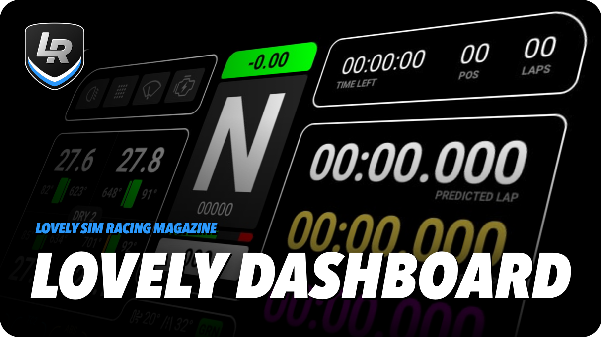
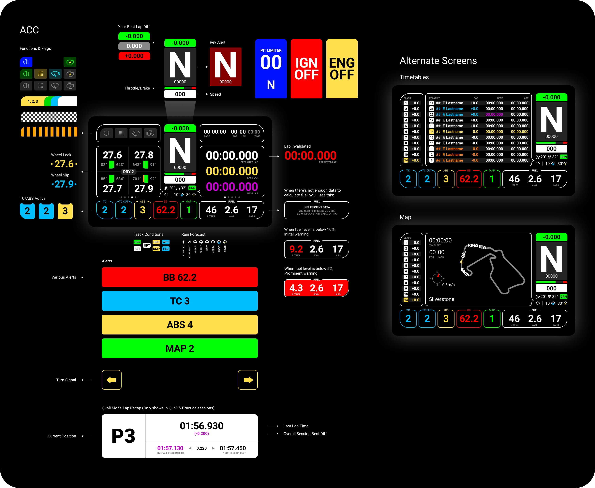

<h1 align="center">Lovely SimHub Dashboard</h1>

A multifunctional feature packed SimHub Dashboard (DDU) and a matching Stream Overlay.

 
Works with the most popular simulators

 
---
 
 

<strong><em>JOIN the Discord Server</em></strong> 
Join the Lovely Sim Racing Discord Server and help develop a better version. 
👉 <a href="http://j76.me/LSRDiscord">Discord Server</a>

 
 

### 🔌 If you like this dashboard & overlay, please consider subscribing to my Youtube channel [Lovely Sim Racing](http://j76.me/LSR), where I stream as often as I can. You'll even see them both in action.

### Please consider [buying me a coffee](http://j76.me/BuyMeCoffee) :coffee: or snagging some [Lovely Merch](http://j76.me/LSRStore) 

#### Check out my other projects:
* [**Lovely Stream Deck Icons**](http://j76.me/LSRIcons)
* [**Lovely Sim Racing Liveries**](http://j76.me/LSRLivery)

---

 
<h4 align="center">
<a href="https://youtu.be/_XAIlmhVY0s">
 
Watch the introductory video
</a>
</h4> 

## What's Included
In the [Releases](https://github.com/cdemetriadis/lovely-dashboard/releases) section, you will find:

1. [**Lovely Dashboard**](#the-lovely-dashboard) - A custom designed dashboard to use on your phone or dedicated DDU Screen
2. **Lovely Dashboard XL** - An oversized version of the Lovely Dashboard for the new 10" DDU Screens.
3. **Lovely Overlay** - If you're a streamer, you can use this overlay in OBS or any other broadcasting software
4. **LED Profiles** - Multiple LED profiles for your DDU Screens

## Download & Install
This is a SimHub Dashboard, therefore **SimHub Dash** app is required to run it (Doh!). Also, since the UI was a considerate design, you will also need to download and install the **Roboto Font Family** from Google (free).

1. Download & Install [SimHub Dash v8.0+](https://www.simhubdash.com) app
2. Download & Install [Roboto Font Family](https://fonts.google.com/specimen/Roboto) by Christian Robertson
3. Download & Install the [**Lovely Dashboard Latest Release**](https://github.com/cdemetriadis/lovely-dashboard/releases)

#### For iRacing
If you want to use the Lovely Dashboard with iRacing, you will need to copy the file `RSC.iRacingExtraProperties.dll` into the `./Simhub/` root folder.

1. Download Romainrob's [**RSC.iRacingExtraProperties.dll**](https://drive.google.com/drive/folders/1AiIWHviD4j-_D-zgRrjJU1AFhJ_xmass)

:warning: **Warning: Simhub Dash v8.0+** is required to run the Lovely Dashboard 1.5.0+

## Settings
As of version 1.5.4, the Lovely Dashboard can also be setup to your liking. You will need to copy the file `Lovely-Dashboard_settings.json` into the `./Simhub/JavascriptExtensions` folder. 

To change your personal settings, you can edit the file `Lovely-Dashboard_settings.json` in any text editor. The available settings are outlined in the dedicated [**Settings Page**](./docs/settings.md)
  
## Compatibility
This is an ongoing project, so I will add more Screen Sizes and Sims as time progresses, but these are the ones I use so it's where I started.

### Screen Size
* Native **5" (850x480)** and **10" (1920x720)** DDU Screens 
* Any 16:9 or 21:9 screen ratio is ideal, but...
* Any device compatible with SimHub is fine

### Compatible Sims
* Assetto Corsa Competizione
* iRacing
* Automobilista 2 **(NEW)**
* rFactor 2 **(NEW)**

## The Lovely Dashboard
If you were wondering why this is the best SimHub dashboard out there, wonder no more. It's good looking and feature packed but with considerate design and proper information architecture. 

🖥 **View the [Full Feature Set](docs/features.md)**

## Contributing
Would you like to contribute to the **Lovely Dashboard & Overlay**? If yes, then head on over to the [**Developers Doc**](docs/developers.md) and find out how you can get started.

  

---

  

### Disclaimer

All trademarks, logos and brand names are the property of their respective owners. All company, product and service names used in this application are for identification purposes only. Use of these names, trademarks and brands does not imply endorsement.

 

This work is licensed under [Creative Commons Attribution-NonCommercial-ShareAlike 4.0 International](http://creativecommons.org/licenses/by-nc-sa/4.0/)
