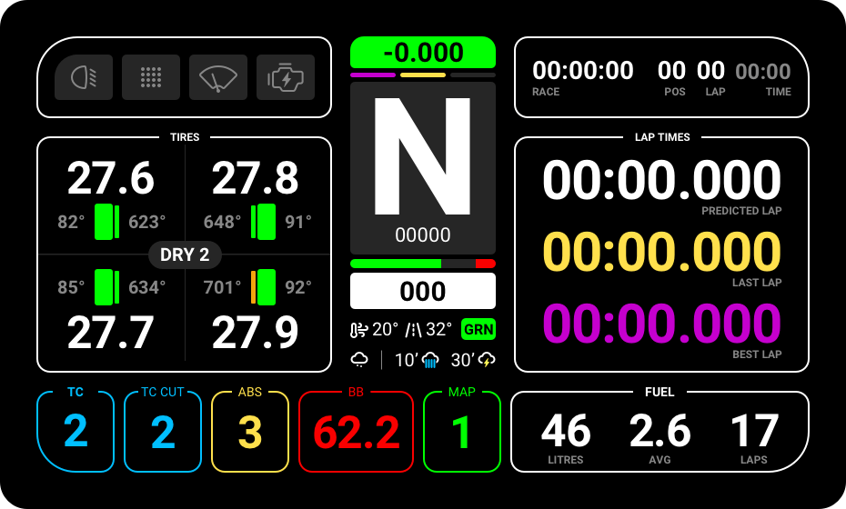
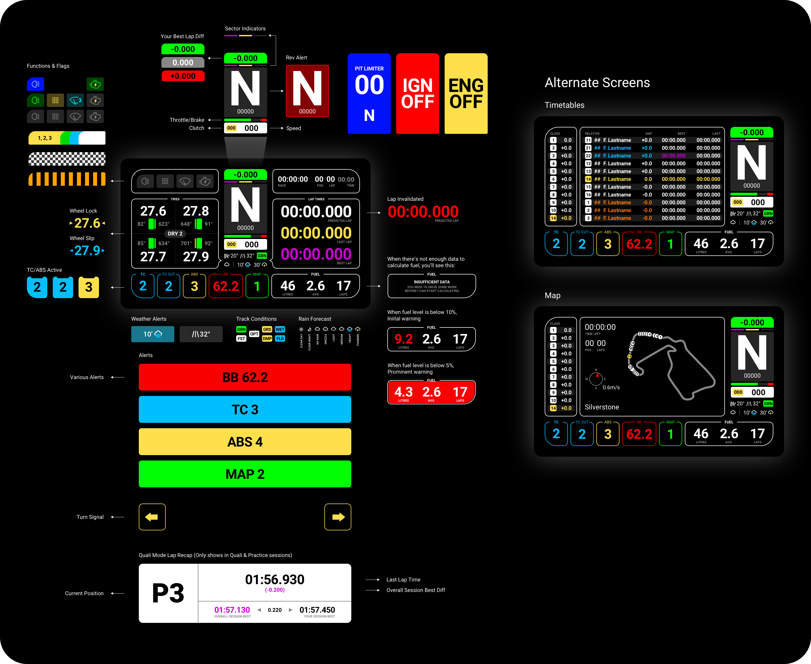

<h1 align="center">Lovely SimHub Dashboard</h1>

<strong>Version 2.0.1 (NEW)</strong>

A multifunctional feature packed SimHub Dashboard (DDU) and a matching Stream Overlay.

 
+ all simulators that suppoort native Simhub data

 
---
 
 

<strong><em>JOIN over 2700 Lovely Sim Racers on Discord</em></strong> 
Join the Lovely Sim Racing Discord Server and help develop a better version. 
👉 <a href="http://j76.me/LSRDiscord">Discord Server</a>

 
 

### 🔌 If you like this dashboard & overlay, please consider subscribing to my Youtube Channel [Lovely Sim Racing](http://j76.me/LSR), where I stream as often as I can.

### Please consider [buying me a coffee](http://j76.me/BuyMeCoffee) :coffee: or snagging some [Lovely Merch](http://j76.me/LSRStore) 

#### Check out my other projects:
* [**Lovely Stream Deck Icons**](http://j76.me/LSRIcons)
* [**Lovely Sim Racing Liveries**](http://j76.me/LSRLivery)

---

## Video Walkthrough

Learn your way around the Lovely Dashboard with this video. Although it is a bit old, the basic principles are the same.
<h4 align="center">
<a href="https://youtu.be/1XCZ4Z6RqOA">
 
Watch the Lovely Dashboard 1.6.3 Walkthrough video
</a>
</h4> 

## What's Included
In the [Releases](https://github.com/cdemetriadis/lovely-dashboard/releases) section, you will find:

1. **Lovely Dashboard** - A custom designed dashboard to use on your phone or dedicated DDU Screen
2. **Lovely Dashboard XL** - An oversized version of the Lovely Dashboard for the new 10" DDU Screens.
3. **Lovely Overlay** - If you're a streamer, you can use this overlay in OBS or any other broadcasting software
4. *Coming Soon* ***Lovely Tower*** - A new leader board tower, great for OBS if you're streaming 
5. *Coming Soon* ***Lovely Flags*** - A new "simple" dashboard to display race flags and platform integration
6. **LED Profiles** - Multiple LED profiles for your DDU Screens

## Download & Install
This is a SimHub Dashboard, therefore **SimHub Dash** app is required to run it (Doh!). Also, since the UI was a considerate design, you will also need to download and install the **Roboto Font Family** from Google (free).

:people_holding_hands: **For more information, tips & feedback, please join the [Lovely Discord](http://j76.me/LSRDiscord)**

### First time install
If this is your first time installing the **Lovely Dashboard**, please follow these steps, and make sure you've completed each before proceeding to the next one.

1. Download & Install [**SimHub Dash**](https://www.simhubdash.com) app
2. Download & Install [**Roboto Font Family**](https://fonts.google.com/specimen/Roboto) by Christian Robertson
3. Download & Install the [**Lovely Dashboard Latest Release**](https://github.com/cdemetriadis/lovely-dashboard/releases)
4. Setup your [**Simuhub Action Keys**](./docs/actions.md) to control the Lovely Dashboard UI
5. ***Optionally***, you can also copy and edit the [**Settings File**](./docs/settings.md) and add the `lovely-dash-bg.jpg` into the `./SimHub/JavascriptExtensions` folder.

### Updating
If you have received a notification on your **Lovely Dashboard** of a new update, please follow the below steps:

1. Download & Install the [**Lovely Dashboard Latest Release**](https://github.com/cdemetriadis/lovely-dashboard/releases)
2. Read the changelog and if prompted, you may also need to update [**SimHub Dash**](https://www.simhubdash.com) and/or the [**Settings File**](./docs/settings.md)

## Settings
As of version 1.5.4, the Lovely Dashboard can also be setup to your liking. You will need to copy the file `Lovely-Dashboard_settings.json` into the `./Simhub/JavascriptExtensions` folder. 

To change your personal settings, you can edit the file `Lovely-Dashboard_settings.json` in any text editor. The available settings are outlined in the dedicated [**Settings File**](./docs/settings.md) page.
  
## Compatibility

### Screen Size
* Any device compatible with SimHub Dash
* Native **5" (850x480)** and **10" (1920x720)** DDU Screens are supported

### Compatible Sims
The Lovely Dashboard offers native support for many sims, but will work with ANY simulator that offers native data to Simhub.

#### Native Support

* [Assetto Corsa Competizione](https://assettocorsa.gg/assetto-corsa-competizione/)
* [Assetto Corsa](https://assettocorsa.gg/assetto-corsa/)
* [iRacing](https://www.iracing.com)
* [Automobilista 2](https://www.game-automobilista2.com)
* [rFactor 2](https://www.studio-397.com/rfactor2/)
* [Formula 1](https://www.ea.com/en-gb/games/f1/)

#### Untested Support

The new **Lovely Dashboard v2.0.0** is no longer locked to any sim. There's a provision for natively supporting a few of the most popular simulators, but it can also be run with ANY simulator. If the data is available, then it will display...

## The Lovely Dashboard
If you were wondering why this is the best SimHub dashboard out there, wonder no more. It's good looking and feature packed but with considered design and proper information architecture. 

## Contributing
Would you like to contribute to the **Lovely Dashboard**? Then head on over to the [**Developers Docs**](docs/developers.md) and find out how you can get started.

## Special Thanks
A special thanks to all of you who have supported this project in [one way](http://j76.me/BuyMeCoffee) or [another](http://j76.me/LSRStore). It could not have been done without you. Special thanks also to these fellas that have contributed to the code:

* **Mike Bowen** (iRacing ERS & MGU)
* **Steve Mattar** (F1 Support)

## Marketing Inquiries
For all marketing inquiries (eg, using the Lovely Dashboard on your marketing material) please send an email to [**marketing@ohmylovely.com**](mailto:marketing@ohmylovely.com).
  

---

 

### Disclaimer

All trademarks, logos and brand names are the property of their respective owners. All company, product and service names used in this application are for identification purposes only. Use of these names, trademarks and brands does not imply endorsement.

 

This work is licensed under [Creative Commons Attribution-NonCommercial-ShareAlike 4.0 International](http://creativecommons.org/licenses/by-nc-sa/4.0/)
