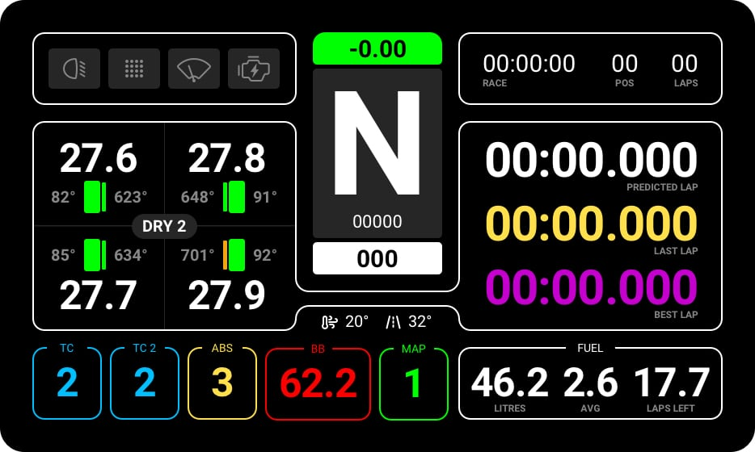
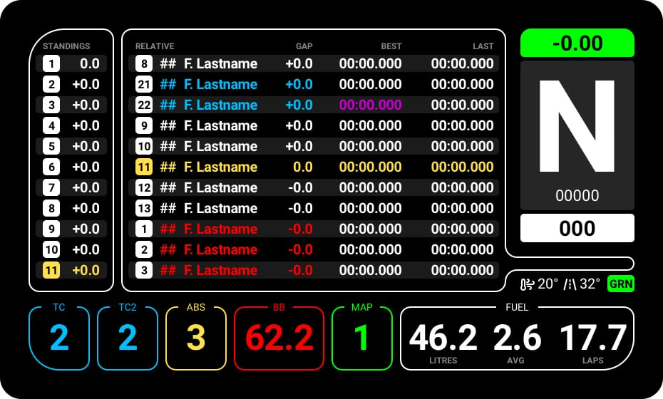
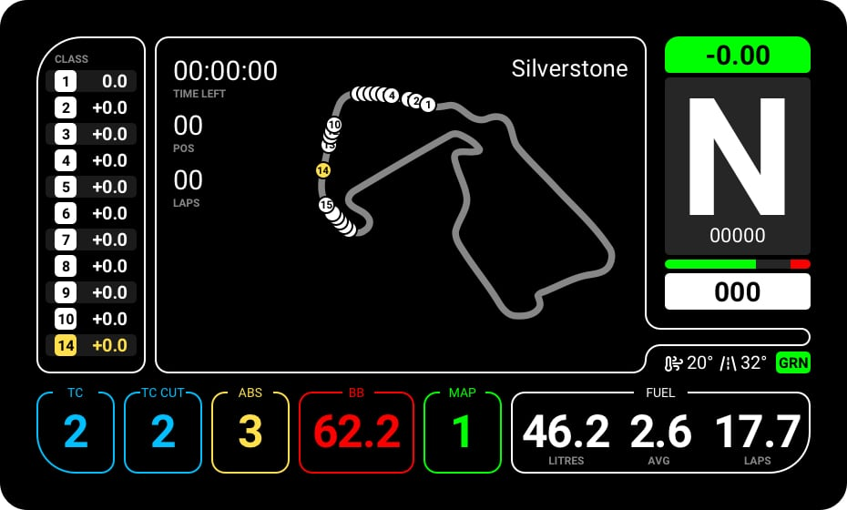
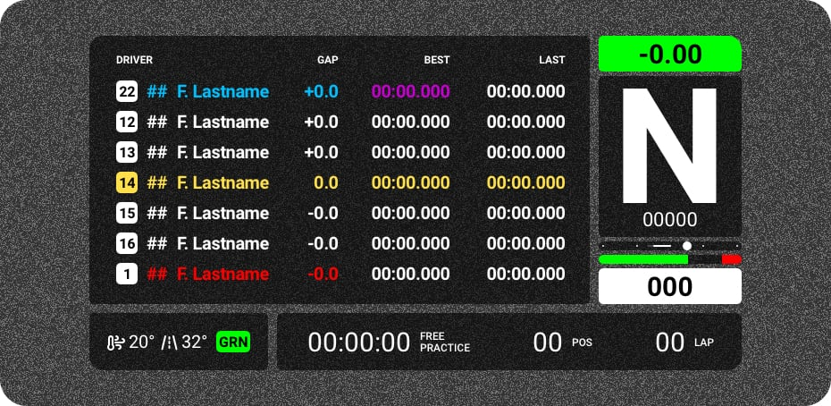

<h1 align="center">Lovely SimHub Dashboard</h1>

A multifunctional feature packed SimHub dashboard (DDU), specifically for Sim Racing.

 
 

<strong>NEW Addition: <a href="#stream-overlay">Stream Overlay</a></strong>

 
 

### 🔌 If you like this dashboard & overlay, please consider subscribing to my Youtube channel [Lovely Sim Racing](http://j76.me/LSR), where I stream as often as I can. You'll even see them both in action.

 

<h4 align="center">
<a href="https://youtu.be/_XAIlmhVY0s">
 
Watch the introductory video
</a>
</h4> 

## What's Included
When you download the zip file, you will get a few things. 

1. [**Lovely Dashboard**](#dashboard) - A custom designed dashboard to use on your phone or dedicated DDU screen
2. [**Lovely Overlay**](#stream-overlay) - If you're a streamer, you can use this overlay in OBS or any other broadcasting software
3. **LED Profile** - A 16x LED profile for your DDU

## Download & Install
This is a SimHub Dashboard, therefore **SimHub Dash** app is required to run it (Doh!). Also, since the UI was a considerate design, you will also need to download and install the **Roboto Font Family** from Google (free).

Finally, download the [**Latest Release**](https://github.com/cdemetriadis/lovely-dashboard/releases). PS: I've also included a 16 LED profile should you need one.

1. [SimHub Dash](https://www.simhubdash.com) app
2. [Roboto Font Family](https://fonts.google.com/specimen/Roboto) by Christian Robertson
3. [**Download latest release**](https://github.com/cdemetriadis/lovely-dashboard/releases)
4. **Double-click** on the `.simhubdash` files (Dashboard & Overlay) to install in SimHub

## Compatibility
This is an ongoing project, so I will add more Screen Sizes and Sims as time progresses, but these are the ones I use so it's where I started.

### Screen Size
* Native 5" 850x480 (VoCore)
* 16:9 screen ratio

### Sims
* Assetto Corsa Competizione

🧬 [Detailed Compatibility List](compatibility.md)

## Dashboard
If you were wondering why this is the best SimHub dashboard out there, wonder no more. Here's the complete feature set.

🖥 **View the [Full Feature Set](features.md)**

### Primary Screen

🖥 **[Primary Screen Features + Options](primary.md)**

### Timetables

🖥 **[Timetables Screen Features](timetables.md)**

### Track Map

🖥 **[Track Map Screen Features](track-map.md)**

## Stream Overlay
If you're a streamer I bet you'll find this matching Overlay a perfect fit. 

🖥 **[Stream Overlay](overlay.md)**