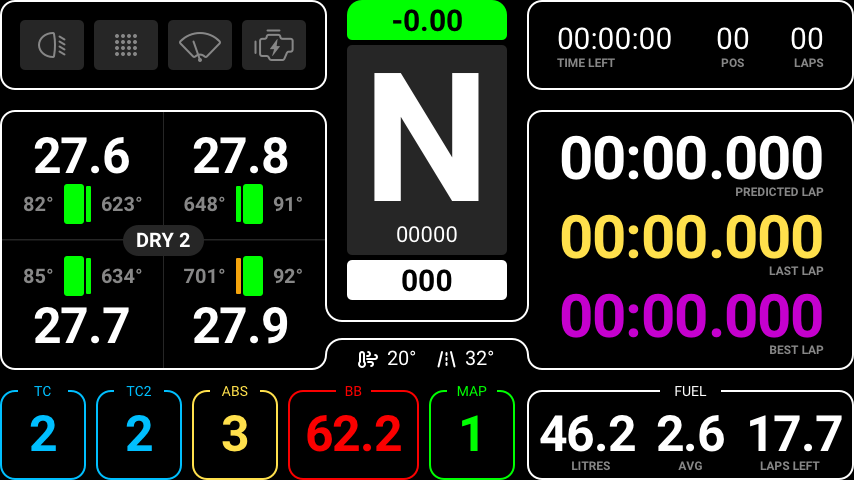
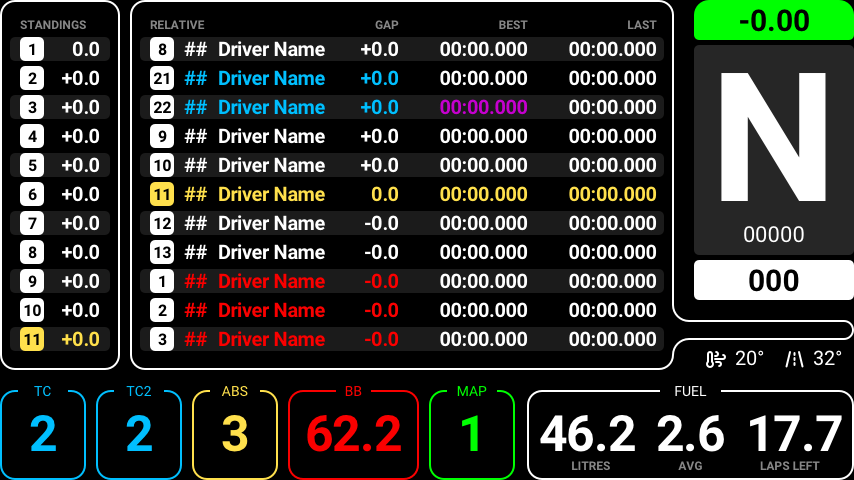
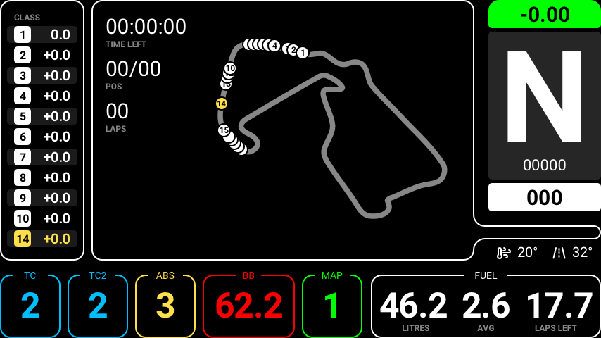

# Lovely SimHub Dashboard
A multifunctional feature packed SimHub dashboard (DDU), specifically for Sim Racing.

> ### If you like this dashboard, please consider subscribing to my Youtube channel [Lovely Sim Racing](http://j76.me/LSR), where I stream as often as I can. You'll even see this Dashboard in action too.

## Game Compatibility

* Assetto Corsa Competizione
	* All vehicles are supported

## Requirements
This is a SimHub Dashboard, therefore **SimHub Dash** app is required to run it (Doh!). Also, since the UI was a considerate design, you will also need to download and install the **Roboto Font Family** from Google.

* [SimHub Dash](https://www.simhubdash.com) app
* [Roboto Font Family](https://fonts.google.com/specimen/Roboto) by Christian Robertson

## Features
If you were wondering why this is the best SimHub dashboard out there, wonder no more. Here's the complete feature set.

### Primary Screen

#### Top Left Module
* Light Stages (Off, On, High Beam & Flashing)
* Rain Light (Off, On)
* Wipers (Off, On Level)
* Ignition (Off, On)

#### Top Right Module
* Time Remaining
* Session Type
* Current Position
* Current Lap Number

#### Center Module
* Live Lap Time Diff to your Session Best
* Gear
* RPM
* Speed

#### Left Module 
Scroll through with Action A

##### Screen 1
* Tyre Status (FL, FR, RL, RR)
	* Tyre Pressure
	* Tyre Temperature (Blue > Green > Red)
	* Brake Temperature (Blue > Green > Red)
* Tyre Type & Set Number

##### Screen 2
* Relative Timetable

##### Screen 3
* Class Standings Timetable

#### Right Module
* Predicted Lap (White, Red when invalidated)
* Last lap
* Session best Lap

#### Bottom Module
* TC Level (flashes when active)
* TC2 level (flashes when active)
* ABS Level (flashes when active)
* Brake Bias
* Map Level
* Fuel
	* Live Fuel Load
	* Average Fuel Consumption per lap
	* Estimated Lap left with current fuel load

### Timetables

### Track Map
