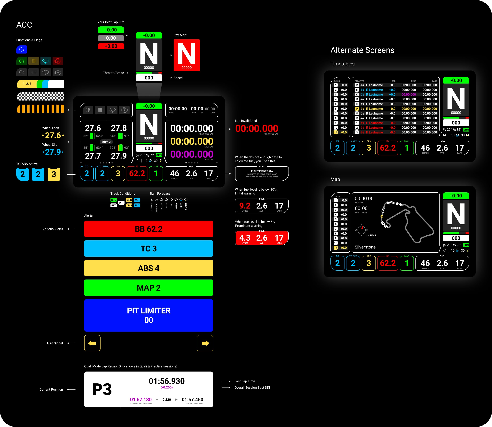
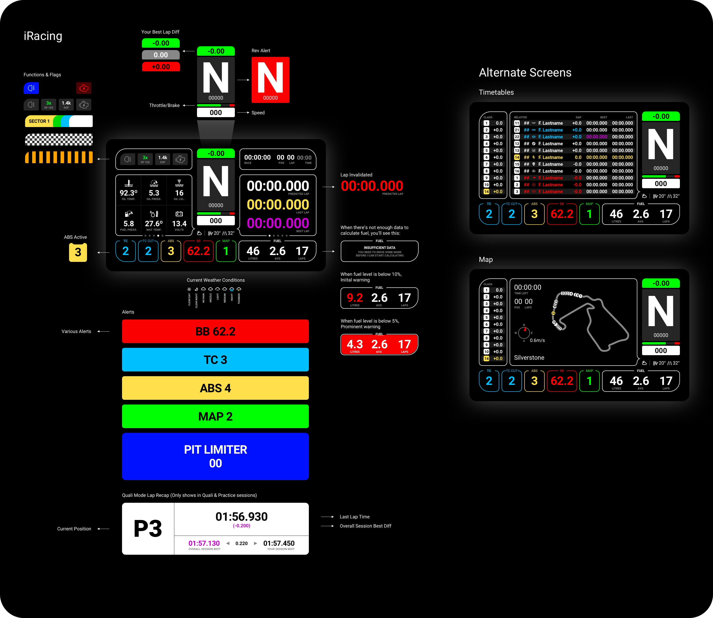

<h1 align="center">Lovely SimHub Dashboard</h1>

A multifunctional feature packed SimHub Dashboard (DDU) and a matching Stream Overlay.

 
 

<strong><em>NEW v1.5.0:</em> Now with iRacing support!</strong> 
New version brings support for the most popular sim racing software on the market and a bunch of new features.

 

<strong><em>NEW Discord Server</em></strong> 
Join the Lovely Sim Racing Discord Server and help develop a better version. 
👉 <a href="http://j76.me/LSRDiscord">Discord Server</a>

 
 

### 🔌 If you like this dashboard & overlay, please consider subscribing to my Youtube channel [Lovely Sim Racing](http://j76.me/LSR), where I stream as often as I can. You'll even see them both in action.

 

<h4 align="center">
<a href="https://youtu.be/_XAIlmhVY0s">
 
Watch the introductory video
</a>
</h4> 

## What's Included
When you download the zip file, you will get a few things. 

1. [**Lovely Dashboard**](#the-lovely-dashboard) - A custom designed dashboard to use on your phone or dedicated DDU screen
2. **Lovely Overlay** - If you're a streamer, you can use this overlay in OBS or any other broadcasting software
3. **LED Profile** - A 16x & 18x LED profile for your DDU

## Download & Install
This is a SimHub Dashboard, therefore **SimHub Dash** app is required to run it (Doh!). Also, since the UI was a considerate design, you will also need to download and install the **Roboto Font Family** from Google (free).

Finally, download the [**Latest Release**](https://github.com/cdemetriadis/lovely-dashboard/releases). 

1. [SimHub Dash](https://www.simhubdash.com) app
2. [Roboto Font Family](https://fonts.google.com/specimen/Roboto) by Christian Robertson
3. [**Download latest release**](https://github.com/cdemetriadis/lovely-dashboard/releases)
4. **Double-click** on the `.simhubdash` files (Dashboard & Overlay) to install in SimHub
 
## Compatibility
This is an ongoing project, so I will add more Screen Sizes and Sims as time progresses, but these are the ones I use so it's where I started.

### Screen Size
* Native 5" 850x480 (VoCore)
* Any 16:9 screen ratio is ideal, but...
* Any device compatible with SimHub is fine

### Compatible Sims
* [Assetto Corsa Competizione](#assetto-corsa-competizione)
* [iRacing](#iracing)

# The Lovely Dashboard
If you were wondering why this is the best SimHub dashboard out there, wonder no more. It's good looking and feature packed but with considerate design and proper information architecture. 

## Assetto Corsa Competizione

🖥 **View the [ACC Full Feature Set](acc/features-acc.md)**

## iRacing

🖥 **View the [iRacing Full Feature Set](iracing/features-iracing.md)**
