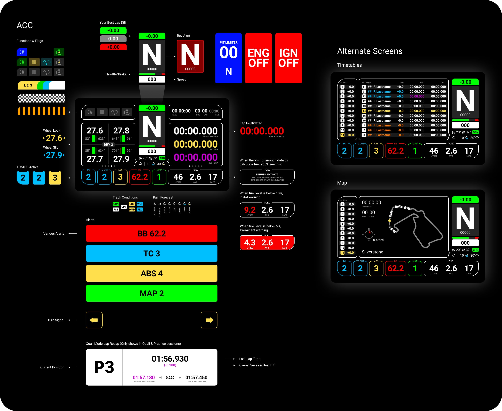
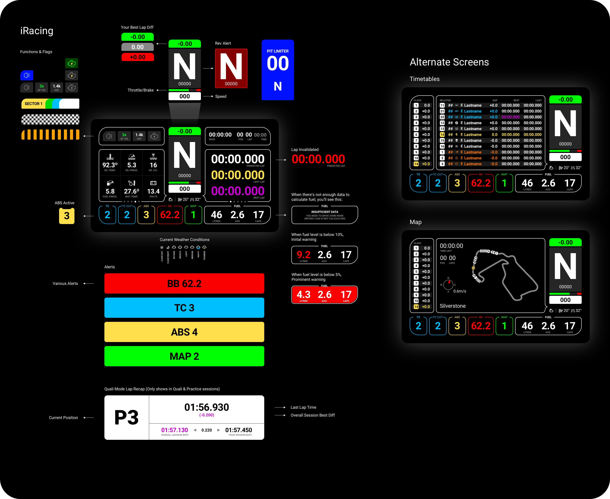

<h1 align="center">Lovely SimHub Dashboard</h1>

A multifunctional feature packed SimHub Dashboard (DDU) and a matching Stream Overlay.

 
 

<strong><em>JOIN the Discord Server</em></strong> 
Join the Lovely Sim Racing Discord Server and help develop a better version. 
👉 <a href="http://j76.me/LSRDiscord">Discord Server</a>

 
 

### 🔌 If you like this dashboard & overlay, please consider subscribing to my Youtube channel [Lovely Sim Racing](http://j76.me/LSR), where I stream as often as I can. You'll even see them both in action.

### You may also consider [buying me a coffee](http://j76.me/BuyMeCoffee) :coffee:

#### Check out my other project: [**Lovely Stream Deck Icons**](http://j76.me/LSRIcons)

--

 
<h4 align="center">
<a href="https://youtu.be/_XAIlmhVY0s">
 
Watch the introductory video
</a>
</h4> 

## What's Included
When you download the zip file, you will get a few things. 

1. [**Lovely Dashboard**](#the-lovely-dashboard) - A custom designed dashboard to use on your phone or dedicated DDU screen
2. **Lovely Overlay** - If you're a streamer, you can use this overlay in OBS or any other broadcasting software
3. **LED Profile** - A 16x & 18x LED profile for your DDU

## Download & Install
This is a SimHub Dashboard, therefore **SimHub Dash** app is required to run it (Doh!). Also, since the UI was a considerate design, you will also need to download and install the **Roboto Font Family** from Google (free).

1. Download & Install [SimHub Dash v8.0+](https://www.simhubdash.com) app
2. Download & Install [Roboto Font Family](https://fonts.google.com/specimen/Roboto) by Christian Robertson
3. Download & Install the [**Lovely Dashboard Latest Release**](https://github.com/cdemetriadis/lovely-dashboard/releases)

#### For iRacing
If you want to use the Lovely Dashboard with iRacing, you will also need to install a library by Romainrob.

1. Download & Install Romainrob's [iRacing Extra Properties DLL](https://drive.google.com/drive/folders/1AiIWHviD4j-_D-zgRrjJU1AFhJ_xmass)

:warning: **Warning: Simhub Dash v8.0+** is required to run the Lovely Dashboard 1.5.0+
 
## Settings (NEW)
As of version 1.5.4, the Lovely Dashboard can also be setup to your liking. You will need to copy the file `Lovely-Dashboard_settings.json` into `./SimHub/JavascriptExtensions`. 

To change your personal settings, you will need to edit the file `Lovely-Dashboard_settings.json` in any text editor. The available settings are:

#### `driverName`
You can change the way the Driver Name is formatted and displayed.

- `0` (Default) - Will display names as "**F. Lastname**"
- `1` Will display names as "**Firstname L.**"

#### `lapReview`
Choose when the Lap Review Alert should appear.

- `0` **Never** show the Lap Review Alert
- `1` (Default) - **Qualifying** & **Practice** - This will only show the Lap Review Alert during **Qualifying** & **Practice** sessions
- `2` **Always** - Will show the Lap Review Alert on every lap

#### `lapReviewDelay`
Set how much time in milliseconds to display the Lap Review Alert. (eg. 1000 = 1 second)

- `5000` (Default) - Display the Lap Review Alert for 5 seconds

**:information_source: If you do not copy the settings file, the default values will be used.**
  
## Compatibility
This is an ongoing project, so I will add more Screen Sizes and Sims as time progresses, but these are the ones I use so it's where I started.

### Screen Size
* Native 5" 850x480 (VoCore)
* Any 16:9 screen ratio is ideal, but...
* Any device compatible with SimHub is fine

### Compatible Sims
* [Assetto Corsa Competizione](#assetto-corsa-competizione)
* [iRacing](#iracing-new)

## The Lovely Dashboard
If you were wondering why this is the best SimHub dashboard out there, wonder no more. It's good looking and feature packed but with considerate design and proper information architecture. 

### Assetto Corsa Competizione

🖥 **View the [ACC Full Feature Set](docs/acc/features-acc.md)**

### iRacing

🖥 **View the [iRacing Full Feature Set](docs/iRacing/features-iracing.md)**

## Contributing
Would you like to contribute to the **Lovely Dashboard & Overlay**? If yes, then head on over to the [**Developers Doc**](developers.md) and find out how you can get started.

  

---

  

### Disclaimer

All trademarks, logos and brand names are the property of their respective owners. All company, product and service names used in this application are for identification purposes only. Use of these names, trademarks and brands does not imply endorsement.

 

This work is licensed under [Creative Commons Attribution-NonCommercial-ShareAlike 4.0 International](http://creativecommons.org/licenses/by-nc-sa/4.0/)
