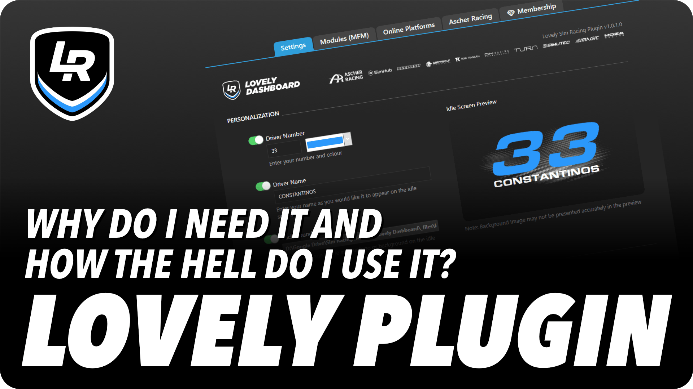
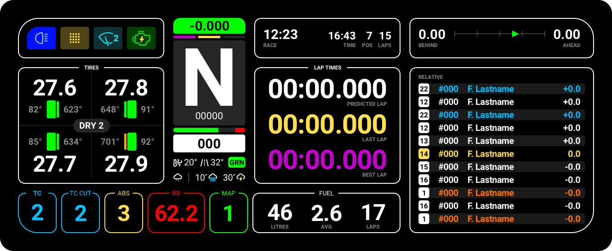

<h1 align="center">Lovely SimHub Dashboard</h1>

A multifunctional feature packed SimHub Dashboard (DDU) and ecosystem.

<h4 align="center">
<strong>v3.2.0 / v2.2.0</strong>
</h4>

<h4 align="center"><strong>
<a href="#video-guide">Video Guide</a> - <a href="#whats-included">What's Included</a> - <a href="#installing">Installing</a> & <a href="#updating">Updating</a> <a href="#what-is-true-dark-mode">True Dark Mode</a> - <a href="#partnerships">Partnerships</a> - <a href="#lovely-membership">Memberships</a> - <a href="#lovely-dashboard-ecosystem">Lovely Ecosystem</a>
</strong></h4>

 

---

 

<h1> 
Become a <a href="https://lsr.gg/membership">Lovely Member</a>, and unlock all the perks!</h1>
(Memberships start at €1/mo)

 

---

### The Lovely Dashboard, used by thousands* of sim racers across the world, has become a staple in all of your sim racing setups. From professionals like **Tony Kanaan** all the way to rookies, the Lovely Dashboard delivers the best and most consistent information for all simulators. 

<strong>*</strong> Google Analytics: 22k Unique Users Mar 2023 - Mar 2024

<strong>Native Simulator & Platform Support</strong> 

&nbsp;&nbsp;&nbsp;&nbsp;&nbsp;&nbsp;&nbsp;&nbsp;&nbsp;&nbsp;

 
+ generic support for all simulators that work with SimHub

---
 

<strong>Lovely Partners</strong> 
 

 

 

 

 
---

 
<strong><em>JOIN over 9500 Lovely Sim Racers on Discord</em></strong> 
Join the Lovely Sim Racing Discord Server and help develop a better version. 
👉 <a href="https://lsr.gg/discord"><strong>Lovely Discord Server</strong></a>

 

---

## Video Guide
<h4 align="center">
<a href="https://www.youtube.com/watch?v=tW6nZ-lHOCw">
 
Watch the Lovely Plugin walkthrough
</a>
</h4>

## What's Included
In the [Releases](https://github.com/cdemetriadis/lovely-dashboard/releases) section, you will find:

1. **Lovely Plugin** - A SimHub Plugin that improves the Lovely experience & performance and makes setup a breeze!
2. **Lovely Dashboard** - A custom designed dashboard to use on your phone or dedicated DDU Screen
3. **Lovely Dashboard Companion** - A custom designed dashboard to use on a secondary display (eg. Steering Wheel)
4. **Lovely Dashboard Companion Portrait** - The Companion, but in Portrait mode
5. **Lovely Dashboard Rallye** - A uber minimal Rallye Dashboard
6. **Lovely Dashboard TK Edition** - The Lovely Dashboard with Tony Kanaan's personal touch
7. **Lovely Dashboard XL** - An oversized version of the Lovely Dashboard for the new 10" DDU Screens
8. **Lovely Dashboard UXL** - An Ultra Wide version of the Lovely Dashboard for 1920x480 DDU Screens
9. **Lovely Dashboard Curved** - A variant of the Lovely Dashboard for curved top DDU's
10. **Lovely Overlay** - If you're a streamer, you can use this overlay in OBS or any other broadcasting software
11. **Lovely Tower** - A leader board tower, great for OBS if you're streaming 
12. **Lovely Flags** - A "simple" dashboard to display race flags and platform integration

## Installing
If this is your first time installing the **Lovely Dashboard**, please follow these steps, and make sure you've completed each before proceeding to the next one.

### Step 1: Download and install SimHub
Download & install [**SimHub**](https://www.simhubdash.com) app, just as you would install any other Windows application on your system. Follow the prompts and once it's installed, proceed to the next step.

### Step 2: Download and install the Lovely Plugin
**Download** the latest **Lovely Plugin Installer** from the [Lovely Website](https://lsr.gg/plugin). Once the file is downloaded, you will need to **double click** on the file and follow the instructions on screen. **Restart SimHub** and enable the Lovely Plugin at the prompt. Finally, **Select "Show in left main menu"**.

### Step 3: Install the Lovely Dashboards
Within the **Lovely Plugin**, navigate to the **Dashboard Manager** tab, and simply click on the dashboard you wish to install, follow the on-screen instructions.

### Step 4: Setup your controls
One of the best features of the Lovely Dashbaord is that it has a multitude of options and screens to choose from. To take full advantage of all the Screens and Modules, you will need to assign certain actions to your steering or button box. Please make sure you assign all of the [**SimHub Action Triggers**](https://store.lsr.gg/pages/help-simhub-actions) in order to control the Lovely Dashboard.

## Updating
If you have received a notification on your **Lovely Dashboard** of a new update, navigate to the **Dashboard Manager** tab and select the dashboard to update.

> [!TIP]
> :people_holding_hands: **For more information, tips & feedback, please join the [Lovely Discord](https://lsr.gg/discord)**

## What is True Dark Mode?
**True Dark Mode** in the Lovely Dashboard is more than just pretty colors. Alongside a new theming architecture responsible for changing the colours and icons, True Dark Mode does more for you than you may think.

**Melatonin** is a hormone made in the body. It regulates night and day cycles or sleep-wake cycles. Darkness triggers the body to make more melatonin, which signals the body to sleep. Light decreases melatonin production and signals the body to be awake. 

In extended driving sessions, especially during the late hours, light may be scarce and the mind starts slipping into a night cycle. To counter the effect of melatonin and reduce the amounts produced in our body, we need to reverse the trigger by using colour hues that negate the melatonin. 

**Blue light not only suppresses melatonin, it also enables the circadian rhythm to help the body maintain alertness.**

Switching to the **Blue True Dark Mode** during these long low-lit driving stints would decrease the amount of melatonin in our body, maintaining alertness.

*Source: [Sleep Foundation](https://www.sleepfoundation.org/bedroom-environment/what-color-light-helps-you-sleep)*

## Partnerships

### Manufacturer Partnerships
One of the most important advancements of the Lovely Dashboard ecosystem is the inclusion for native support by Manufacturers. This means that the Lovely Dashboard now includes native functions that work with directly with various devices either to enhance your experience or simply make setting up the device much simpler.

* [Ascher Racing Integration](./docs/ascher-racing.md)
* Greywolf Technologies **(COMING SOON)**

#### Ascher Racing - [View the Documentation](./docs/ascher-racing.md)

### Branding Partnerships

#### Lovely Dashboard Tony Kanaan Edition
We have partnered with multiple **IndyCar race winner**, **IndyCar Series Champion**, **Indy 500** & **Daytona 24 winner**, Tony Kanaan, to create a uniquely styled Lovely Dashboard. This dashboard includes all the latest features of the Lovely Dashboard but is styled to match Tony Kanaan's identity along with his personal preferences.

## Compatibility

### Screen Size
* Any device compatible with SimHub Dash
* Native **5" (850x480)**, **10" (1920x720)** and **1920x480** DDU Screens are supported

### Compatible Sims
The Lovely Dashboard offers native support for many sims, but will work with ANY simulator that offers native data to SimHub.

#### Native Support

* [Assetto Corsa Competizione](https://assettocorsa.gg/assetto-corsa-competizione/)
* [Assetto Corsa](https://assettocorsa.gg/assetto-corsa/)
* [Assetto Corsa Evo (Bacic Support)](https://assettocorsa.gg/assetto-corsa-evo/)
* [iRacing](https://www.iracing.com)
* [Automobilista 2](https://www.game-automobilista2.com)
* [rFactor 2](https://www.studio-397.com/rfactor2/)
* [Le Mans Ultimate](https://lemansultimate.com/)
* [RaceRoom Racing Experience](https://game.raceroom.com/)
* [Formula 1](https://www.ea.com/en-gb/games/f1/)
* [WRC Series](https://www.ea.com/games/ea-sports-wrc/wrc-24)
* [Richard Burns Rally](https://steamcommunity.com/groups/richardburnsrallypc)

#### Generic Support

As of v2.0.0, the **Lovely Dashboard** is no longer locked to any sim. There's a provision for natively supporting a few of the most popular simulators, but it can also be run with ANY simulator. If the data is available, then it will display...

 

## Lovely Membership
**Become a Lovely Member and gain access to exclusive perks!** All **Lovely Members** have access to frequent updates and releases of the Lovely Dashboard, while **Pro & Gold Lovely Members** also have access to the **Lovely Pit Wall**.
 

  

## Lovely Dashboard Ecosystem
If you were wondering why this is the best SimHub dashboard out there, wonder no more. It's good looking and feature packed but with considered design and proper information architecture. 

### Lovely Dashboard

### Lovely Dashboard Companion 

### Lovely Dashboard Companion Portrait

### Lovely Pit Wall
Available to [**Pro & Gold Lovely Members**](https://lsr.gg/membership) only.

### Lovely Dashbaord TK Edition

### Lovely Dashboard Rallye 

### Lovely Dashboard XL (for 10" DDU's)

### Lovely Dashboard UXL (for 1920x480 DDU's)

### Lovely Overlay

### Lovely Tower

### Lovely Flags

	

## Analytics
#### The Lovely Dashboard uses Google Analytics to collect anonymous data on Product Interactions & Usage. We do not track or store any personal data. Users are free to opt-in or opt-out via the option in the Lovely Plugin.

## Special Thanks
A special thanks to all of you who have supported this project in [one way](https://lsr.gg/membership) or [another](https://lsr.gg/store). It could not have been done without you. Special thanks also to these fellas that have contributed to the code:

* **Derrick Moeller** (Lovely Plugin)
* **Adam Hoyle** (Lovely Plugin)
* **Mike Bowen** (iRacing ERS & MGU)
* **Steve Mattar** (F1 Support)
* **Joerg Behrens** (Settings Configurator)

## Marketing Inquiries
For all marketing inquiries please contact me directly. 

:envelope: [**marketing@lsr.gg**](mailto:marketing@lsr.gg)

> [!NOTE]
> Although the Lovely Dashboard is distributed for free, usage of its user interface design (UI) is also subject to the license it is distributed under. Any use in commercial or marketing material, promotional still or animated images and videos is forbidden unless direct consent is given. Please contact me directly if you wish to use the images on any of your material.

---
 

<strong>Lovely Partners</strong> 

 

 

 
---

 

### License

Read the (Software License on the Lovely Website)[https://lsr.gg/license]

 

&copy; 2025 Lovely Sim Racing