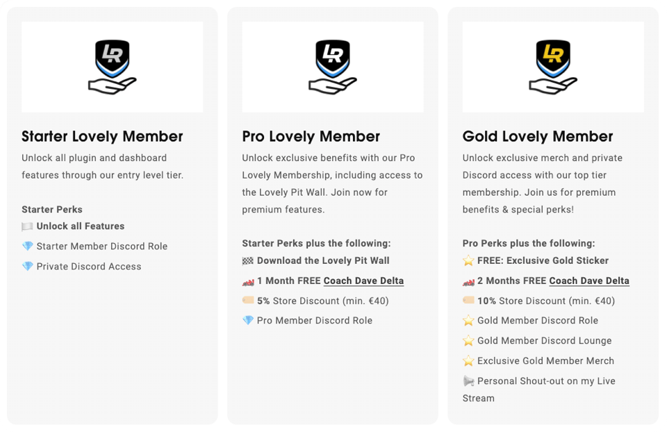

<h1 align="center">Lovely SimHub Dashboard</h1>

A multifunctional feature packed SimHub Dashboard (DDU) and ecosystem.

<h4 align="center">
<strong>NEW v2.6.0 - Now with True Dark Mode!</strong>
</h4>

 

<h4 align="center"><strong>
<a href="#video-tours--guides">Video Guides</a> - <a href="#download--install">Download & Install</a> - <a href="#settings">Settings</a> - <a href="#what-is-true-dark-mode">True Dark Mode</a> - <a href="#lovely-membership">Lovely Membership</a> - <a href="#lovely-dashboard-ecosystem">Lovely Ecosystem</a>
</strong></h4>

 

---

### The Lovely Dashboard, used by thousands* of sim racers across the world, has become a staple in all of your sim racing setups. From professionals like **Tony Kanaan** all the way to rookies, the Lovely Dashboard delivers the best and most consistent information for all simulators.

<strong>*</strong> Google Analytics: 18k Unique Users Mar 2023 - Jan 2024

<strong>Native Simulator & Platform Support</strong> 

&nbsp;&nbsp;&nbsp;&nbsp;&nbsp;&nbsp;&nbsp;&nbsp;&nbsp;&nbsp;

 
+ generic support for all simulators that work with SimHub

---
 

<strong>Lovely Partners</strong> 

 

 
---

 
<strong><em>JOIN over 5000 Lovely Sim Racers on Discord</em></strong> 
Join the Lovely Sim Racing Discord Server and help develop a better version. 
👉 <a href="https://lsr.gg/discord"><strong>Lovely Discord Server</strong></a>

 

## Video Tours & Guides
<h4 align="center">
<a href="https://youtube.com/live/mhGbmHBr7g4">
 
Watch the Lovely Dashboard 2.6.0 Walkthrough
</a>
</h4>

<h4 align="center">
<a href="https://youtu.be/QkQtfakUxRk">
 
Watch the Lovely Dashboard Configurator
</a>
</h4>

## What's Included
In the [Releases](https://github.com/cdemetriadis/lovely-dashboard/releases) section, you will find:

1. **Lovely Dashboard** - A custom designed dashboard to use on your phone or dedicated DDU Screen
2. **Lovely Dashboard XL** - An oversized version of the Lovely Dashboard for the new 10" DDU Screens.
3. **Lovely Overlay** - If you're a streamer, you can use this overlay in OBS or any other broadcasting software
4. **Lovely Tower** - A leader board tower, great for OBS if you're streaming 
5. **Lovely Flags** - A "simple" dashboard to display race flags and platform integration

## Download & Install
### First time install
If this is your first time installing the **Lovely Dashboard**, please follow these steps, and make sure you've completed each before proceeding to the next one.

1. Download & Install [**SimHub**](https://www.simhubdash.com) app
2. Download & Install [**Roboto Font Family**](https://fonts.google.com/specimen/Roboto) by Christian Robertson
3. Download & Install the [**Lovely Dashboard**](https://github.com/cdemetriadis/lovely-dashboard/releases) you need
4. Setup your [**SimHub Action Triggers**](./docs/actions.md) to control the Lovely Dashboard UI
5. ***Optionally***, you can extend and personalise the Lovely Dashboard by using the [**Settings File**](./docs/settings.md).

### iRacing Extra Properties required
**For iRACING USE ONLY** you will also want to download and enable Romainrob's plugin. Download **`RSC.iRacingExtraProperties.dll`** and **`RSC.iRacingExtraPorperties.pdb`** from the [**Official Google Drive**](https://drive.google.com/drive/folders/1AiIWHviD4j-_D-zgRrjJU1AFhJ_xmass) and copy them into your Simhub root folder. Restart Simhub, and then in `Simhub > Settings > Plugins` enable the Plugin:

### Updating
If you have received a notification on your **Lovely Dashboard** of a new update, please follow the below steps:

1. Download & Install the [**Lovely Dashboard Latest Release**](https://github.com/cdemetriadis/lovely-dashboard/releases)
2. Read the changelog and if prompted, you may also need to update [**SimHub**](https://www.simhubdash.com) and/or the [**Settings File**](./docs/settings.md)

> [!TIP]
> :people_holding_hands: **For more information, tips & feedback, please join the [Lovely Discord](https://lsr.gg/discord)**

## Settings
The Lovely Dashboard is a highly customizable dashboard. You can tailor it to your personal needs and adapt how it functions. To take full advantage of the Lovely Dashboard you'll need to copy the file `Lovely-Dashboard_settings.json` into the `./Simhub/JavascriptExtensions` folder. 

To change your personal settings, you can either edit the file `Lovely-Dashboard_settings.json` directly in any text editor **OR** use the new [**Settings File Configurator**](https://lsr.gg/configurator).

The available settings are outlined in the dedicated [**Settings File**](./docs/settings.md) page.

## What is True Dark Mode?
**True Dark Mode** in the Lovely Dashboard is more than just pretty colors. Alongside a new theming architecture responsible for changing the colours and icons, True Dark Mode does more for you than you may think.

**Melatonin** is a hormone made in the body. It regulates night and day cycles or sleep-wake cycles. Darkness triggers the body to make more melatonin, which signals the body to sleep. Light decreases melatonin production and signals the body to be awake. 

In extended driving sessions, especially during the late hours, light may be scarce and the mind starts slipping into a night cycle. To counter the effect of melatonin and reduce the amounts produced in our body, we need to reverse the trigger by using colour hues that negate the melatonin. 

**Blue light not only suppresses melatonin, it also enables the circadian rhythm to help the body maintain alertness.**

Switching to the **Blue True Dark Mode** during these long low-lit driving stints would decrease the amount of melatonin in our body, maintaining alertness.

> [!TIP]
> To use True Dark Mode, you will need to [enable it in the Settings File](./docs/settings.md#true-dark-mode) and [setup your Hot-Key in Simhub](./docs/actions.md#setup-hot-keys).

*Source: [Sleep Foundation](https://www.sleepfoundation.org/bedroom-environment/what-color-light-helps-you-sleep)*

## Compatibility

### Screen Size
* Any device compatible with SimHub Dash
* Native **5" (850x480)** and **10" (1920x720)** DDU Screens are supported

### Compatible Sims
The Lovely Dashboard offers native support for many sims, but will work with ANY simulator that offers native data to SimHub.

#### Native Support

* [Assetto Corsa Competizione](https://assettocorsa.gg/assetto-corsa-competizione/)
* [Assetto Corsa](https://assettocorsa.gg/assetto-corsa/)
* [iRacing](https://www.iracing.com)
* [Automobilista 2](https://www.game-automobilista2.com)
* [rFactor 2](https://www.studio-397.com/rfactor2/)
* [Formula 1](https://www.ea.com/en-gb/games/f1/)

#### Generic Support

As of v2.0.0, the **Lovely Dashboard** is no longer locked to any sim. There's a provision for natively supporting a few of the most popular simulators, but it can also be run with ANY simulator. If the data is available, then it will display...

 

## Lovely Membership
**Become a Lovely Member and gain access to exclusive perks!** All **Lovely Members** have access to frequent updates and releases of the Lovely Dashboard, while **Pro & Gold Lovely Members** also have access to the **Lovely Pit Wall**.
 

  

## Lovely Dashboard Ecosystem
If you were wondering why this is the best SimHub dashboard out there, wonder no more. It's good looking and feature packed but with considered design and proper information architecture. 

### Lovely Dashboard

### Lovely Pit Wall
Available to [**Pro & Gold Lovely Members**](#lovely-membership) only.

### Lovely Dashboard XL (for 10" DDU's)

### Lovely Overlay

### Lovely Tower

### Lovely Flags

	

## Analytics
#### The **Lovely Dashboard** uses Google Analytics to collect anonymous data on Product Interactions & Usage. **We do not track or store any personal data. Users are free to opt-in or opt-out via the optional [**Settings File**](./docs/settings.md).**

> [!NOTE]
> By downloading and installing the settings file, you accept that the Lovely Dashboard will use cookies to collect anonymous data. You have the option to opt-out in the settings file.

## Special Thanks
A special thanks to all of you who have supported this project in [one way](https://lsr.gg/membership) or [another](https://lsr.gg/store). It could not have been done without you. Special thanks also to these fellas that have contributed to the code:

* **Mike Bowen** (iRacing ERS & MGU)
* **Steve Mattar** (F1 Support)
* **Joerg Behrens** (Settings Configurator)

## Marketing Inquiries
For all marketing inquiries please contact me directly. 

:envelope: [**marketing@lsr.gg**](mailto:marketing@lsr.gg)

> [!NOTE]
> Although the Lovely Dashboard is distributed for free, usage of its user interface design (UI) is also subject to the license it is distributed under. Any use in commercial or marketing material, promotional still or animated images and videos is forbidden unless direct consent is given. Please contact me directly if you wish to use the images on any of your material.

---
 

<strong>Lovely Partners</strong> 

 

 
---

 

### Disclaimer

All trademarks, logos and brand names are the property of their respective owners. All company, product and service names used in this application are for identification purposes only. Use of these names, trademarks and brands does not imply endorsement unless otherwise stated.

 

This work is licensed under [Creative Commons Attribution-NonCommercial-ShareAlike 4.0 International](http://creativecommons.org/licenses/by-nc-sa/4.0/)
