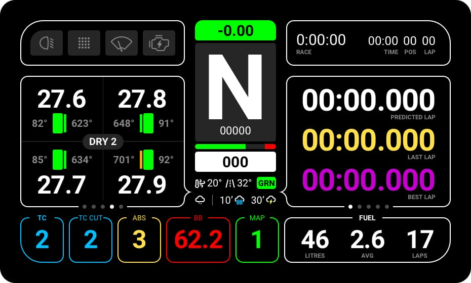

# *ACC* / Primary Screen

### Top Left Module
1. Light Stages (Off, On, High Beam & Flashing)
2. Rain Light (Off, On)
3. Wipers (Off, On Level)
4. Ignition (Off, On)
5. Flags
	* Yellow (Global, Sector)
	* Green
	* Blue
	* White
	* Orange
	* Checkered

### Top Right Module
1. Time Remaining
2. Session Type
3. Track Time
3. Current Position
4. Current Lap Number

### Center Module
1. Live Lap Time Diff to your Session Best
2. Gear
3. RPM
4. Speed
5. Throttle/Brake Input
6. Air Temp
7. Track Temp
8. Track Status
9. Rain Forecast

### Left Module 
1. Tyre Pressure (FL, FR, RL, RR)
2. Tyre Temp & Color (FL, FR, RL, RR)
3. Brake Temp & Color (FL, FR, RL, RR)
4. Tyre Type & Set Number

👉 [+ Action A & B modules](actions-acc.md)

### Right Module
1. Predicted Lap (White, Red when invalidated)
2. Last Lap
3. Session Best Lap

👉 [+ Action A & B modules](actions-acc.md)

### Bottom Module
1. TC Level (Flashes when active)
2. TC2 Level (Flashes when active)
3. ABS Level (Flashes when active)
4. Brake Bias
5. Map Level
6. Fuel Information
	1. Live Fuel Load
	2. Average Fuel Consumption per Lap
	3. Estimated Laps Left with current Fuel Load

👉 [+ Action C modules](actions-acc.md)