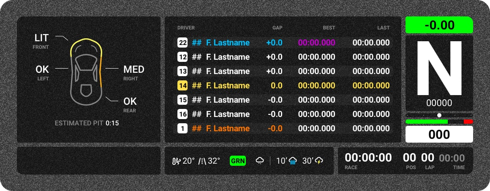

# *ACC* / Stream Overlay

### Damage Module
1. Front (Light, Medium and Heavy)
2. Left
3. Right
4. Rear 
5. Estimated Pit time required

### Timetable Module
1. Relative Timetable
2. Blue Color Highlights Backmarkers
3. Red Color Highlights Leaders
4. Purple Time for Best Lap of Session

### Gear Module
1. Live Lap Time Diff to your Session Best
2. Gear
3. RPM
4. Steering Input Angle
5. Force Feed Back
6. Throttle/Brake Input
7. Speed

### Bottom Left Module
1. Air Temp
2. Track Temp
3. Track Status
4. Rain Forecast **(NEW)**

### Bottom Right Module
1. Time Remaining
2. Session Type
3. Current Position
4. Current Lap Number
5. Track Time