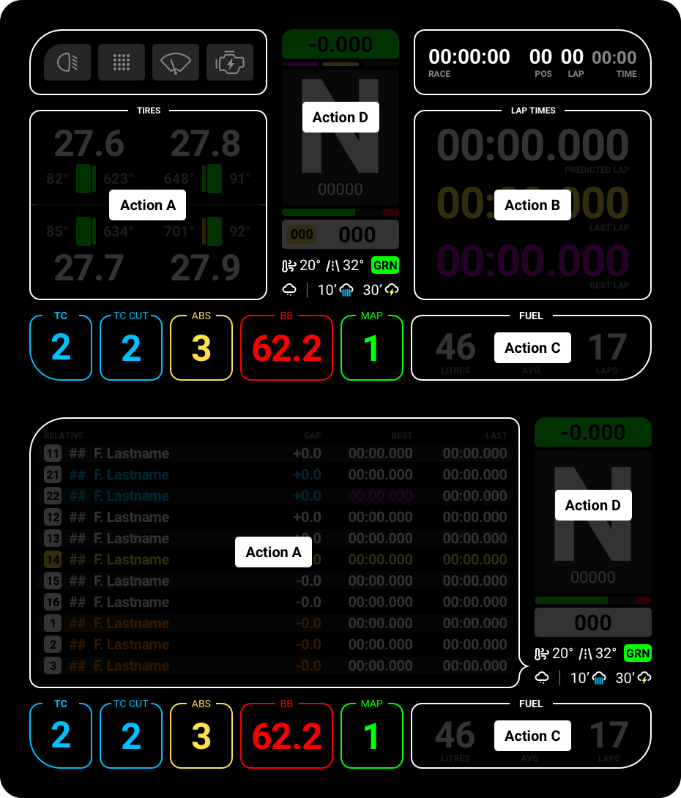

# Available Actions
***Please note that each simulator has slightly different features, depending on the data provided by SimHub.***

Actions in SimHub are ways to change "pages" on certain parts of the screen. This way, everyone can quickly glance at various information on the same screen.

In Simhub, you will need to assign the actions to buttons on your Wheel, Button Box or even Stream Deck. You can choose whatever makes sense for your personal needs.

# Assigning Actions in Simhub
The Lovely Dashboard is pre-configured out-of-the-box to work with Touch Gestures. 

## How to setup Touch Controls

### Mobile and Tablets
If used on Mobile or Tablets, the actions are already set and ready to be used.
Tapping on the appropriate area, will change the page. Swiping left or right on the top part of the dash (Functions or Session) will go to next/previous screen.

### Dedicated DDU (Advance Touch Mode)

To use Touch Controls, you must set your device to Advanced touch mode in `Devices > {Your Device} > LCD`

#### Record Your Actions

In `Devices > {Your DDU} > Controls`, find the action you want to map, and hit `Click to configure`. While the window is open, touch your device in the appropriate area. You should see the tap recorded in the window. Hit `SAVE` and you're set. Repeat for each action...

Please be aware, when you have Hardware buttons assigned the Touch actions may not work. 

## How to Setup Hardware Controls
You can setup hardware controls depending on the device you want to use.

### Mobile and Tablets
To setup hardware controls on your mobile or tablet, you will need to navigate to `Dash Studio > Settings`. Find the action you want to map, and hit `Click to configure`. While the window is open, tap the button you want to assign to that action. You should see the tap recorded in the window. Hit `SAVE` and you're set. Repeat for each action...

### Dedicated DDU
To setup hardware controls on your DDU, you will need to navigate to `Devices > {Your Device} > Controls`. Find the action you want to map, and hit `Click to configure`. While the window is open, tap the button you want to assign to that action. You should see the tap recorded in the window. Hit `SAVE` and you're set. Repeat for each action... 
