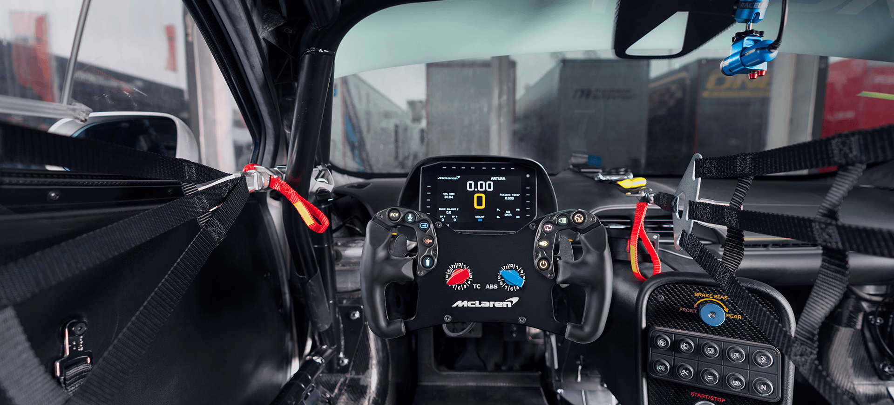

---

> [!CAUTION]
> **REQUIRED!** Ascher Racing Firmware version 1.1b9 (or higher)
> [**Download Here**](https://github.com/Lovely-Sim-Racing/lovely-dashboard/releases/tag/v2.7.0)

---

<h3 align="center">
Get 5% off any purchase from <a href="https://ascher-racing.com">Ascher Racing</a> using code <code>LOVELYDASH</code>
</h3>

---

<h4 align="center"><strong>
<a href="#video-walkthrough">Video Walkthrough</a> - <a href="#device-compatibility">Device Compatibility</a> - <a href="#rotary-dials">Rotary Dials</a> - <a href="#device-settings">Device Settings</a>
</strong></h4>

---

# About
The Ascher Racing steering wheels are considered to be some of the best out there. In fact, the real life **McLaren Artura GT4** comes with the **Ascher Racing McLaren Artura GT4** steering wheel. No joke!

The actual sim racing steering wheels also comes with a few advanced features that are now baked into the Lovely Dashboard.

# Video walkthrough
<h4 align="center">
<a href="https://youtu.be/L9o4S-p4258">
 
Watch the Ascher Racing + Lovely Dashboard Integration Video</a>
</h4>

# Device Compatibility

| Device | Dials | Bite Point | Clutch Calibration | Analogue Input Mode |
|:---|:---:|:---:|:---:|:---:|
| **Ascher Racing McLaren Artura ULTIMATE** | ✅ | ✅ | ✅ | ✅ |
| **Ascher Racing McLaren Artura PRO USB** | ✅ | ✅ | ✅ | ✅ |
| **Ascher Racing McLaren Artura PRO SC** | ✅ | ❌ | ❌ | ❌ |
| **Ascher Racing McLaren Artura SPORT USB ⚑** | ❌ | ✅ | ✅ | ✅ |
| **Ascher Racing McLaren Artura SPORT SC** | ❌ | ❌ | ❌ | ❌ |
| **Ascher Racing McLaren Artura GT4 ⚑** | ✅ | ❌ | ✅ | ✅ |
| **Ascher Racing F64-SC** | ✅ | ❌ | ❌ | ❌ |
| **Ascher Racing F64-USB** | ❌ | ❌ | ❌ | ❌ |
| **Ascher Racing F28-SC** | ❌ | ❌ | ❌ | ❌ |

(⚑) Clutch Paddles sold separately.

# Rotary Dials
The **Rotary Dials** in the center of the steering wheel can be used as simple rotaries, but with the advanced features of the Ascher Racing Artura Series, you can convert them into modifier switches. These modifier switches control the output of other buttons or rotaries on the steering wheel, thus giving you a vast number of inputs.

### Customise the Rotary Dials
You can customise the Labels shown on the screen of the Lovely Dashboard by using the [**Settings Configurator**](https://lsr.gg/config), additionally you can also purchase the [**Lovey Ascher Racing Sticker Sheet**](https://store.lsr.gg/collections/stickers) for the Ascher Racing Artura Series steering wheel.

# Device Settings
The **Ascher Racing Artura Series** steering wheels allow you to customise a few things on the wheel itself. Now, with the **Lovely Dashboard integration** you can see exactly what you're changing, along with useful information and instructions.

### Bite Point
To enter Clutch Bite Point mode, hold the right funky switch down for at least 1 second. 

### Clutch Calibration
To enter Clutch Calibration mode, hold down the **two left or right buttons** to colibrate the **left or right paddle**. You have three seconds to pull on the appropraite paddle, at which point the steering wheel will exit and save the maximum travel.

### Analogue Input Mode
To enter the Analogue Input Mode selection, press on the two buttons adjacent to the screen for at least 1 second. Follow the on screen instruction to change the Analaogue Input Mode from **`Throttle / Brake`**, **`Slave / Master`** and finally **`Master / Slave`**. Save your selection by holding down the same buttons for at least 3 seconds.

Analogue Input mode will exit automatically without saving after 10 seconds. 

