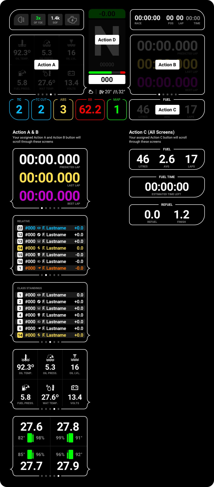

# Available Actions

Actions in SimHub are ways to change "pages" on certain parts of the screen. This way, everyone can quickly glance at various information on the same screen.

In Simhub, you will need to assign the actions to buttons on your Wheel, Button Box or even Stream Deck. You can choose whatever makes sense for your personal needs.

Here's a really short thread on [setting the Action Buttons in SimHub](https://www.simhubdash.com/community-2/postid/1392/) 

## iRacing

#### Action A & B
Assigned **Action A** and **Action B** scrolls through each below

1. Session Lap Times
2. Relative Timetable
3. Class Standings Timetable
4. Vehicle Status
5. Cold Tyre Status & Wear

#### Action C (Bottom Module)
Assigned **Action C** scrolls through each below

1. Essential Fuel Info
2. Estimated Remaining Time
3. Refuel Calculator

#### Action D (Center Module)
Assigned **Action D** scrolls through each below

1. Personal session lap delta on 
2. Personal session lap delta off