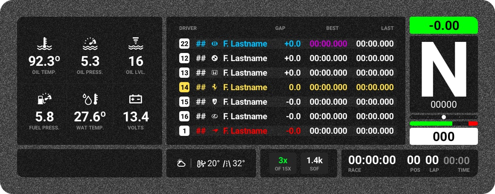

# *iRacing* / Stream Overlay

### Vehicle Status Module
1. Oil Temperature
2. Oil Pressure
3. Oil Level
4. Fuel Pressure
5. Water Temperature
6. Battery Voltage

### Timetable Module
1. Relative Timetable
2. Blue Color Highlights Backmarkers
3. Red Color Highlights Leaders
4. Purple Time for Best Lap of Session

### Gear Module
1. Live Lap Time Diff to your Session Best
2. Gear
3. RPM
4. Steering Input Angle
5. Force Feed Back
6. Throttle/Brake Input
7. Speed

### Bottom Left Module
1. Air Temp
2. Track Temp
3. Track Conditions

### Bottom Center Module
1. Incident Count / Limit
2. Strength of Field

### Bottom Right Module
1. Time Remaining
2. Session Type
3. Current Position
4. Current Lap Number